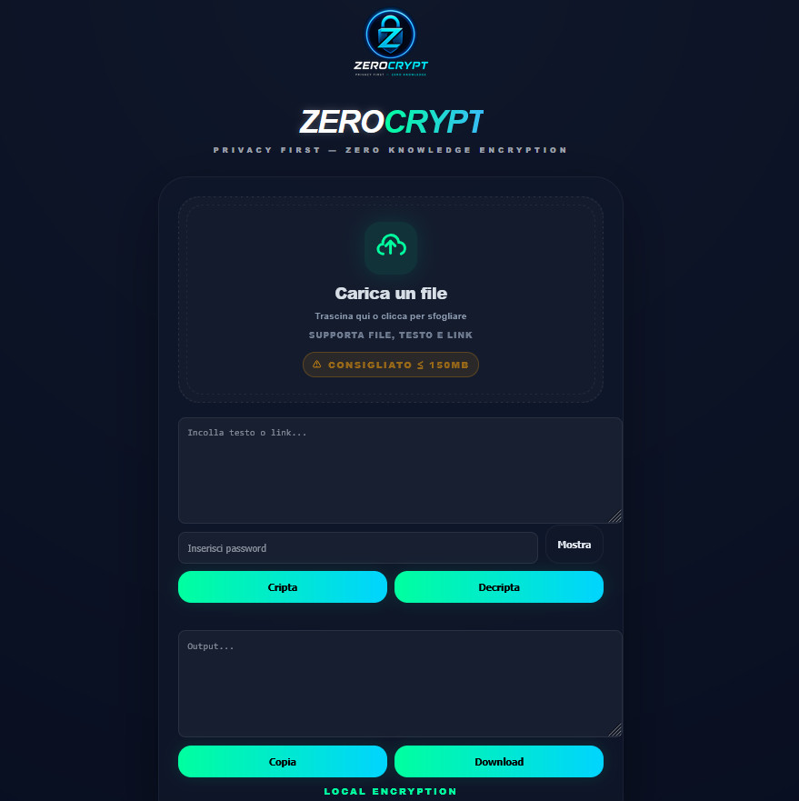

# ZeroEncrypt (ZeroCrypt)

ZeroEncrypt è un tool di crittografia locale (client-side) che permette di criptare file, testo e link direttamente nel browser, senza upload verso il server.

## Caratteristiche

- Crittografia locale tramite Web Crypto API (AES-GCM)
- Nessun upload: il server ospita solo file statici (HTML/CSS/JS)
- Interfaccia IT/EN con preferenza salvata in locale
- UI in stile “ZeroDrop family”

## Struttura progetto

```text
encrypt/
├── assets/
│   └── zerocrypt-logo.png
├── index.html
├── script.js
└── style.css
```

## Deploy

Carica i file su qualsiasi hosting statico (ad es. Apache/Nginx) mantenendo la struttura delle cartelle.

Nota: la cartella `assets/` deve contenere almeno `zerocrypt-logo.png` come referenziato in [index.html](file:///c:/Users/boxbu/Documents/trae_projects/encrypt/index.html#L24-L26).

## Licenza

MIT
