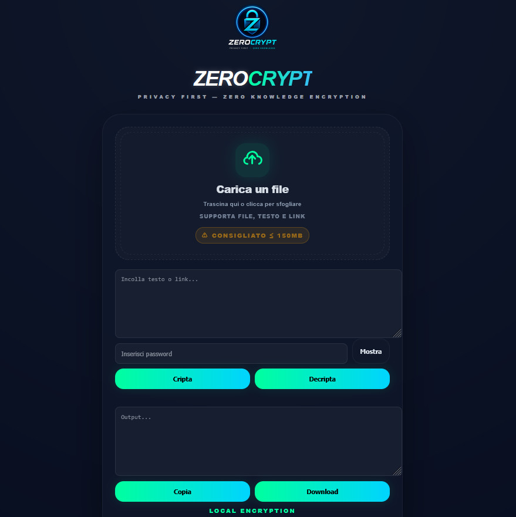

# ZeroEncrypt (ZeroCrypt)

**🌐 English** · [🇮🇹 Italiano](README.it.md)

ZeroEncrypt is a client-side encryption tool that encrypts files, text and links
directly in the browser, with no upload to the server.

## Features

- Local encryption via the Web Crypto API (AES-GCM)
- No uploads: the server hosts static files only (HTML/CSS/JS)
- IT/EN interface, with the preference saved locally
- "ZeroDrop family" UI style

## Project structure

```text
ZeroCrypt/
├── assets/
│   └── zerocrypt-logo.png
├── index.html
├── script.js
└── style.css
```

## Deployment

Upload the files to any static hosting (Apache, Nginx, or similar), keeping the
folder structure intact.

Note: the `assets/` folder must contain at least `zerocrypt-logo.png`, which is
referenced by `index.html`.

## License

MIT
